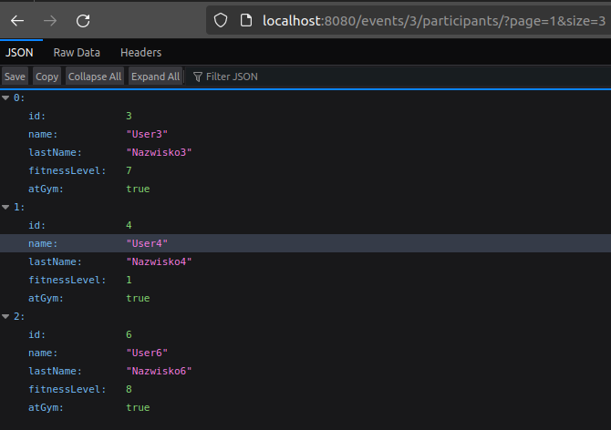

Tworzenie Szkieletu aplikacji Webowej,
Łączenie z bazą danych,
Mockowanie danych,
Tworzenie trójwarstwowej aplikacji,
Proste zapytania,
Przekazywanie parametrów w adresie
N+1 problem + rozwiązanie
Java Data, własne zapytania JPQL, następnie generowane przez konwencję nazewniczą
Stronicowanie
applying in memory problem + rozwiązanie - nie zwracanie fetchowanych danych

Problem z encjami podczas wyrzukiwania Eventów po Id Trenera -> należało dodać adnotacje JoinColumn - dodaje kolumnę TRAINER_ID do eventow. ale blad byl jednak w maperze, bo nie dodawalem id.
Bez JoinColumn tworzona jest nowa tabela. Rowniez jest problem przy zwracaniu eventow. w naszym przypadku każdy event (większość) powinna mieć prowadzących, więc wydajniej jest dodać kolumnę. 

fetch z Pageable - rozwiązanie - podwójne zapytanie id z pageable, potem dociaganie

zwracanie fetchowanych parametrów z encji.

relacja wiele do wielu z określeniem własnej tabeli

modyfikacja, usuwanie - pamiętać o cascade,

problem przy modyfikowaniu (uczestnikow eventu), najpiewr usuwa wszystko a potem dodaje?

Rekurencyjny problem:

Antywzorzec modyfikacji - bo są listy a nie sety?

# Endpoints
TODO
/events/{id}/enroll
/events/{id}/unenroll
/home...
/dashboard...
/trainer - jakies modyfikacje trenera? update.

- **/home** 
  - TODO GET ???
    - Request 
      - Empty
    - Response
      - usersCount (Long)
      - trainerCount (Long)
  - TODO **/find** - wyszukiwarka
    - GET
      - Request
        - dyskryminator (Long) - czego szukamy (Event, Trainer, User)
        - .......
        - konkretne parametry ??? głównie po nazwie
        - page (Long)
        - size (Long)
      - Response
        - result (List< ??? >) w zalezności od wyszukiwania to się zwróci?
    
    - TODO **/events** - eventy
      - Specyficzne dla eventow?
    - TODO **/trainers** - trenerzy
      - specyficzne dla trenerow?

- **/events** - lista wszystkich eventów
  - GET
    - Request
      - page (Long)
      - size (Long)
    - Response
      - events (List< EventShortDto>)
  - POST
  TODO: Zrobić Posta
    - Request
      - event (EventDto)
      - Trainer (z tokena?)

  - **/{id}** - konkretny event
    - GET
      - Request
        - eventId (Long)
      - Response
        - eventDto (EventDto)
    - DELETE - wycofanie się z eventu
      - Request
        - courseId (Long) - path
        - userId (Long)
      - Response
        - success (boolean)
    - **/participants** - uczestnicy
      - GET
        - Request
          - courseId (Long) - path
          - page (Long)
          - size (Long)
        - Resonse
          - participants (List< UserShortDto>)
      - PUT - zapisanie się na event.
        - Request
          - courseId (Long) - path
          - userId (Long)
        - Response
          - success (boolean)
          - info (String) - informacja od konkretnego eventu

- **/trainers** - lista trenerów 
  - GET
    - Request
      - page (Long)
      - size (Long)
    - Response
      - trainers (List< TrainerShortDto>)
  - **/{id}** - konkretny trener
    - GET
      - Request
        - trainerId (Long) - path
      - Response
        - trainer (TrainerDto)
    - **/events** - lista eventów które prowadzi
      - GET
        - Request
          - trainerId (Long) - path
          - page (Long)
          - size (Long)
        - Response
          - events (List< EventShortDto>)

- **/dashboard/{id}**

Tu będzie profil usera konkretnego, razem z możliwościa modyfikacji - tylko ten konkretny user,
po jakimś tokenie?

/events

/events/{id}

/events/{id}/participants

/events/{id}/participants PUT - zapisanie się na event

/events/{id} DELETE - usunięcie eventu

/events/{id} PUT - modyfikacja eventu

/events POST - dodanie eventu

/trainers

/trainers/{id}

/trainers/{id}/events/

